# Vision architecture

Vision is an outcome-driven engineering workflow built around explicit contracts, bounded execution, risk-selected verification, and honest completion states. Its execution graph is optional: small or effectively linear work stays linear.

This document separates three different things:

- **Current runtime architecture** — behavior implemented on public `main`.
- **Experimental intake work** — repository-readiness behavior under evaluation, not a current release contract.
- **Evaluation architecture** — how Vision is compared with bare Codex; it does not itself prove effectiveness.

## 1. End-to-end workflow

**Status:** current runtime architecture.

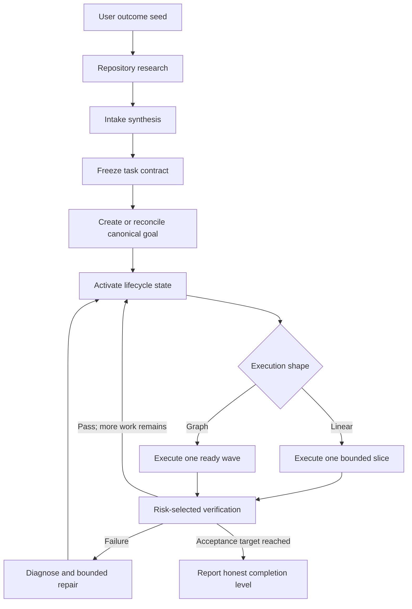

Vision repeatedly chooses the smallest useful next action until the frozen acceptance contract is satisfied or a real stop condition is reached.

## 2. Repository readiness intake

**Status:** experimental intake behavior, not part of the current public release contract.

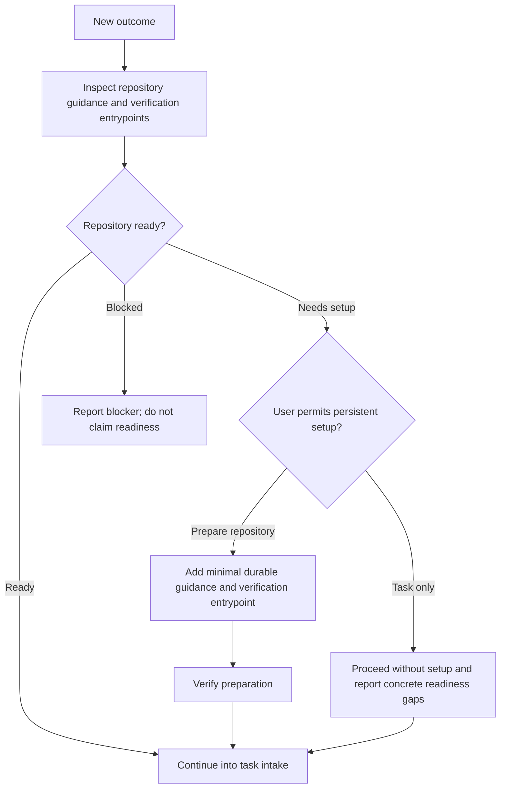

This doctor policy is deliberately shown as experimental. It must not be interpreted as shipped behavior until its implementation and matched evaluation land independently.

## 3. Task sizing and execution shape

**Status:** current runtime architecture.

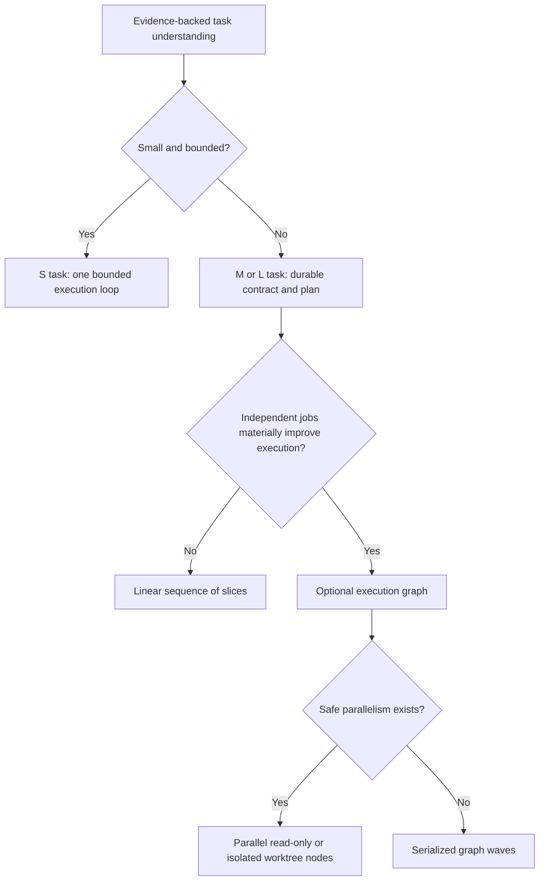

Size controls planning persistence and execution shape. It does not weaken verification, grant permissions, or justify parallelism by itself.

## 4. Slice decomposition

**Status:** current runtime architecture, with a known model-authored boundary.

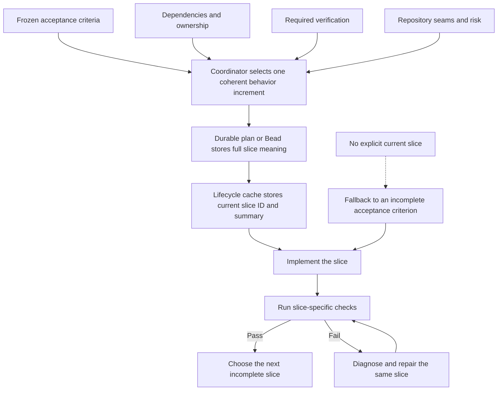

Slices are intended to be independently verifiable behavior increments, not arbitrary file groups or role labels. The coordinator currently authors the decomposition; the runtime enforces the selected action but does not mechanically prove that the complete slice set is minimal, non-overlapping, or globally optimal.

## 5. Lifecycle action selection

**Status:** current runtime architecture.

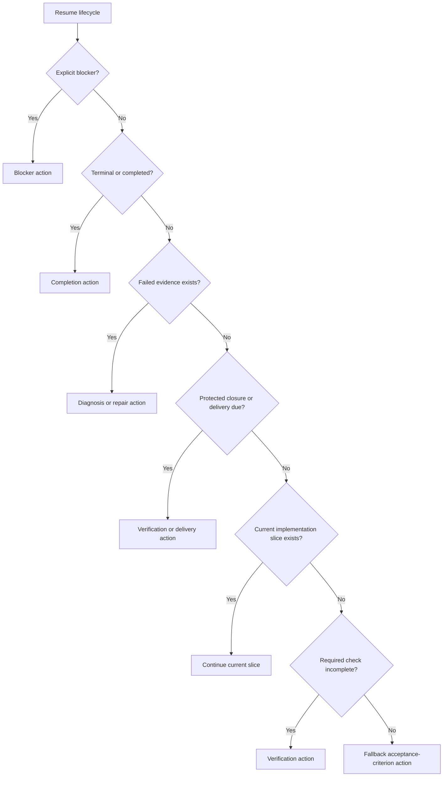

The selected “next slice” is really a generic lifecycle action. It may be implementation, verification, diagnosis, protected closure, delivery, completion, or a blocker.

## 6. Optional dependency-aware execution graph

**Status:** current runtime architecture.

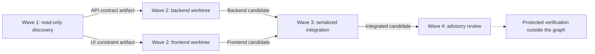

Each graph node has an explicit execution contract:

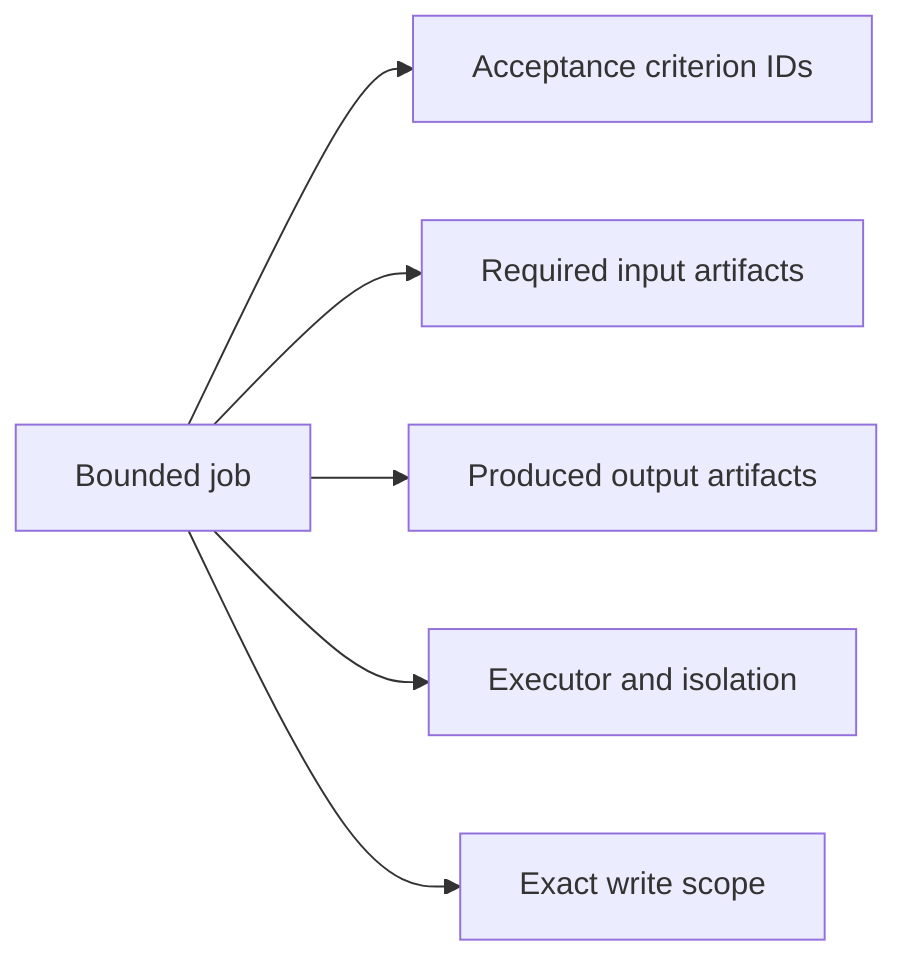

Edges represent named artifacts consumed downstream, not mere chronology. Required upstream failure blocks fan-in. Independent read-only or worktree-isolated nodes may run together; shared-workspace writers serialize. The graph is frozen at task-contract level—Vision does not generate a new graph for every slice.

## 7. Agent topology and duplication guard

**Status:** current runtime architecture.

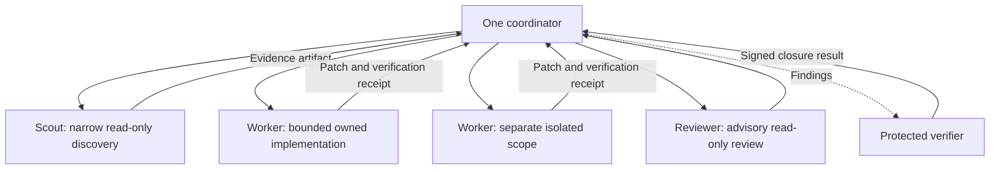

The coordinator owns the contract, integration, lifecycle state, and final interpretation. Leaf roles do not create competing management trees. Concurrent workers must not receive overlapping write scope, and builder-side agents cannot become protected verifiers merely by running in another chat.

## 8. Verification and authority boundary

**Status:** current runtime architecture.

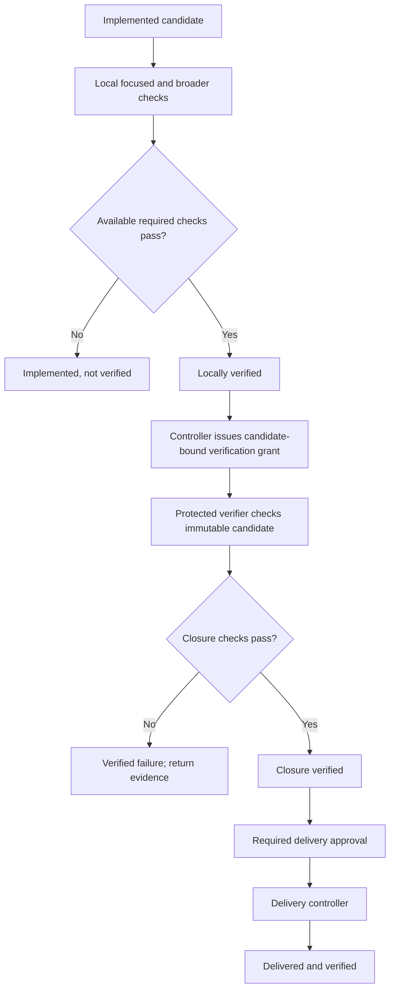

Builders can produce developer evidence but cannot promote themselves through protected closure. Local tests prove only their declared scope. Protected closure requires an immutable candidate, a trusted harness, protected profiles, and a grant signed outside candidate execution.

## 9. Failure and bounded repair

**Status:** current runtime architecture.

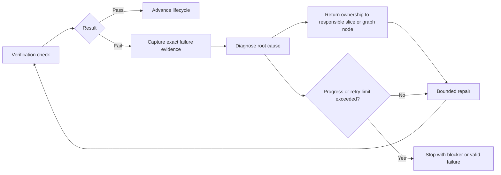

The gate stays intact. Vision repairs the implementation rather than weakening required checks or relabeling inconclusive evidence as success.

## 10. Matched evaluation against bare Codex

**Status:** evaluation architecture, not runtime architecture and not an effectiveness claim.

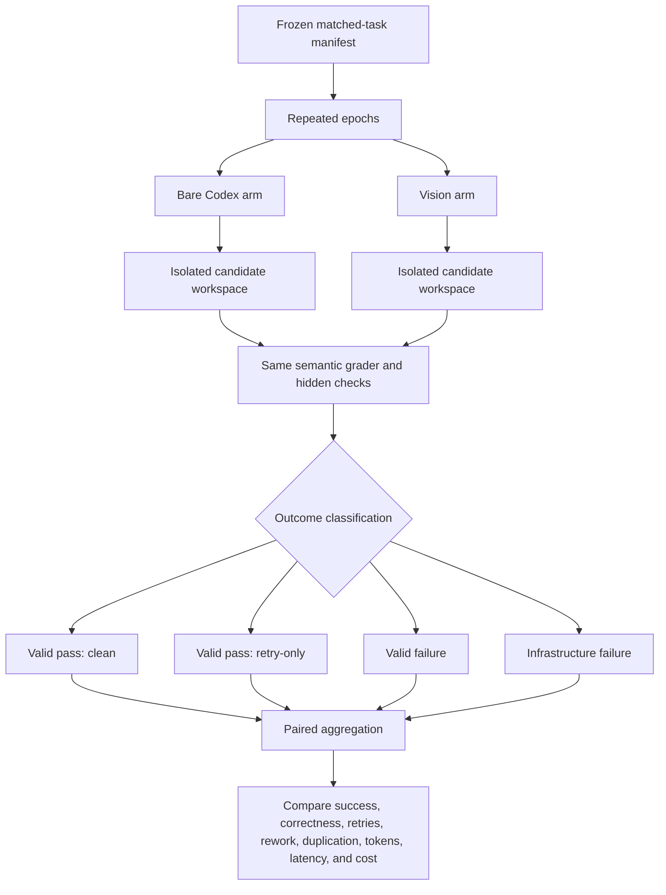

Infrastructure failures remain distinct from task failures, and retry-only passes remain distinct from clean passes. Broad claims require repeated matched pairs with frozen manifests and reproducible graders.

## Honest completion states

Vision reports one of four evidence levels:

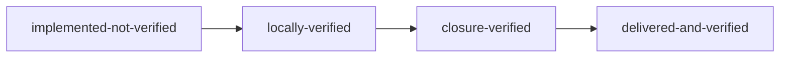

Each transition requires new evidence or authority. Goal state, lifecycle cache, reviewers, and conversation confidence cannot promote the candidate by themselves.

## Main architectural pressure points

- Slice decomposition remains model-authored rather than mechanically optimized.
- The lifecycle's “next slice” abstraction covers several different action kinds.
- Graph fan-out is optional and must justify its coordination cost.
- Orchestration context, intake, retries, and environment recovery can cost more than implementation on small tasks.
- Token savings, parallelism, or cleaner reporting are not wins unless verified task success and verification correctness stay intact.

## Source map

- [Vision workflow](../plugins/vision/skills/vision/SKILL.md)
- [Lifecycle selector](../plugins/vision/scripts/lifecycle-model.mjs)
- [Graph orchestration](graph-orchestration.md)
- [Verification model](verification-model.md)
- [Protected verifier](protected-verifier.md)
- [Campaign protocol](campaign.md)
